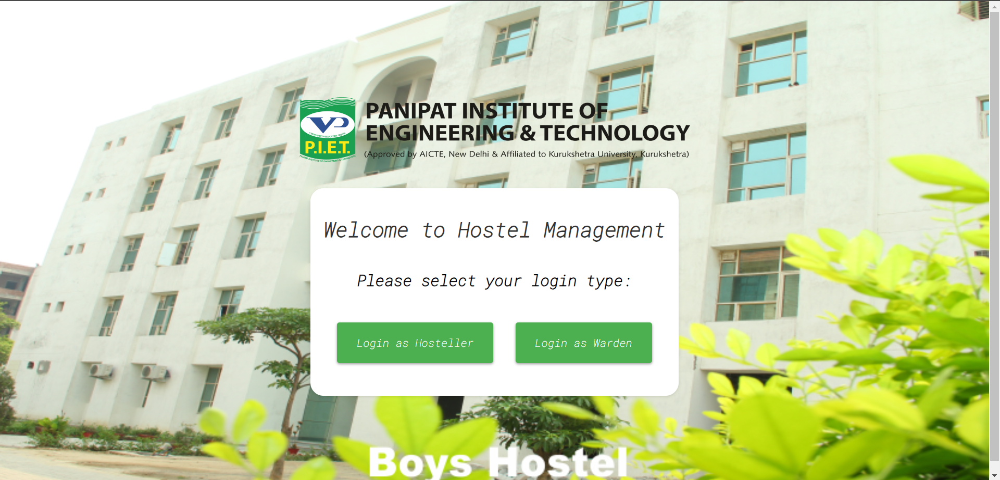
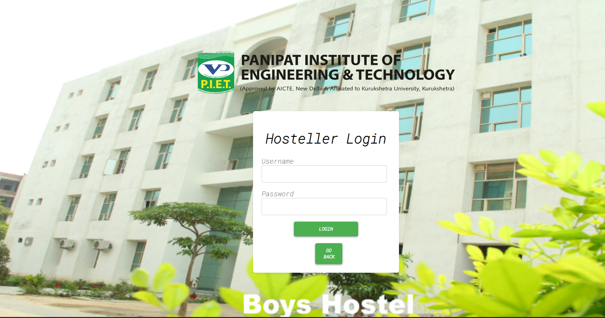
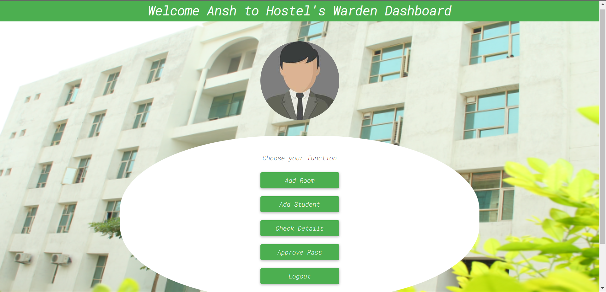
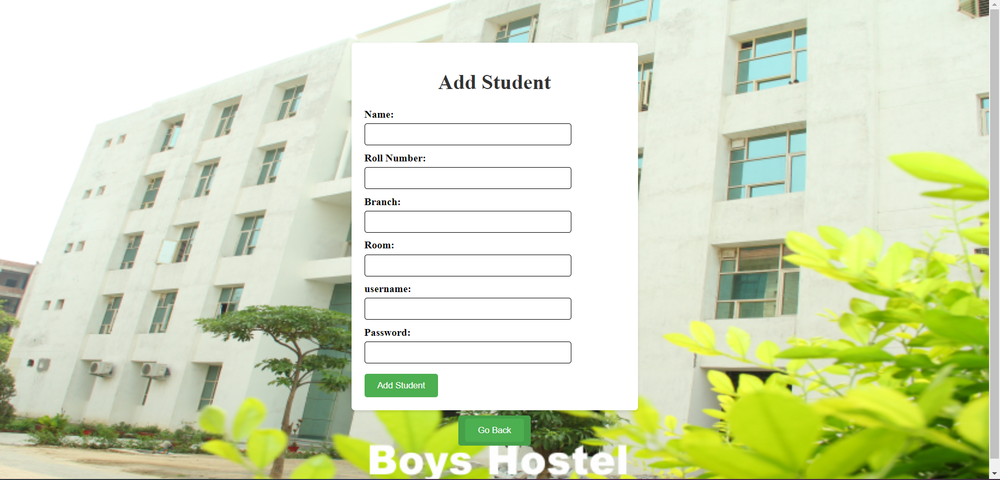
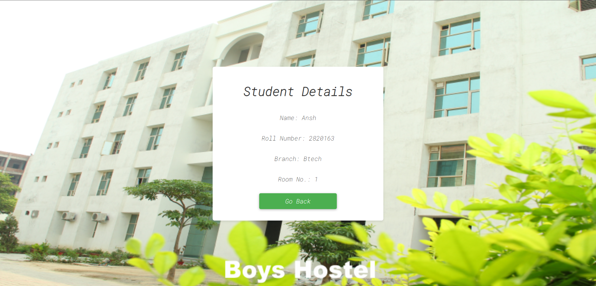
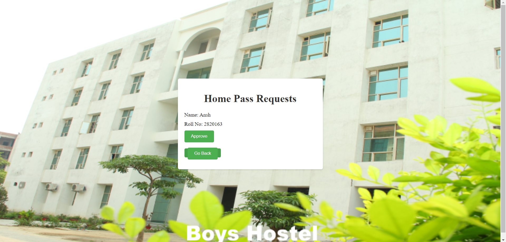
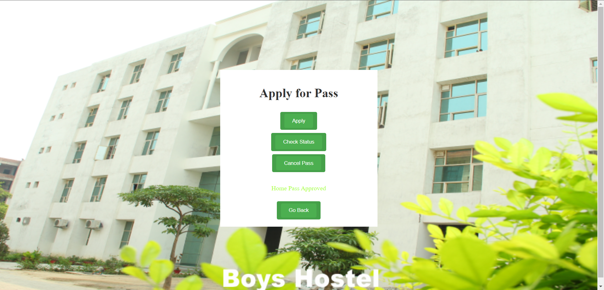

# HostelEase

- A web application that helps in managing the activities that take place inside a hostel premises. 
- The purpose of creating this application was to replace the traditional physical methods and use a digitized platform to manage the activities of the hostel. It provides a separate user interface for warden of hostel and hostel residents. The warden dashboard has several features such as adding room, adding student, approve pass and check details of students. The student dashboard has features like applying for home pass and changing room application.
- This application was created using Node.js and Express.js along with EJS templates engine and MongoDB as database.
  
## Images

## Set Up

- Install MongoDB Database on your system
- Create a Database named as "hostel_management"
- Create a collection named "warden" inside the database
- Create a document inside the collection with attributes "username", "password" and "name" with desired values

## Running the project

- Execute command "nodemon server.js"
- Now you can login with the credentials that were created during project setup
- Warden has the ability to add student and provide a hosteller with its credentials
