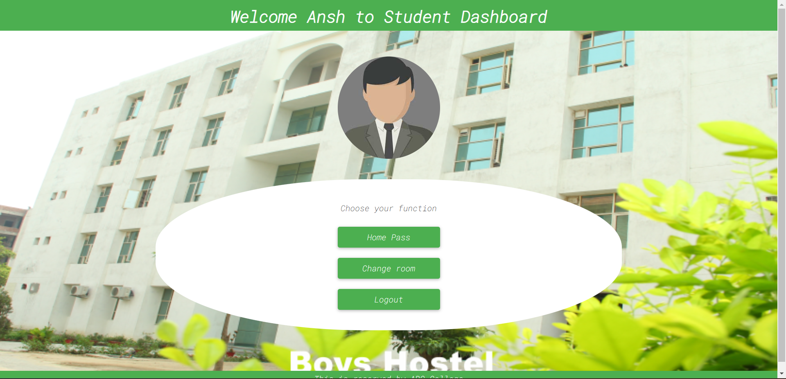

# HostelEase

## Images

## Set Up

- Install MongoDB Database on your system
- Create a Database named as "hostel_management"
- Create a collection named "warden" inside the database
- Create a document inside the collection with attributes "username", "password" and "name" with desired values

## Running the project

- Execute command "nodemon server.js"
- Now you can login with the credentials that were created during project setup
- Warden has the ability to add student and provide a hosteller with its credentials
